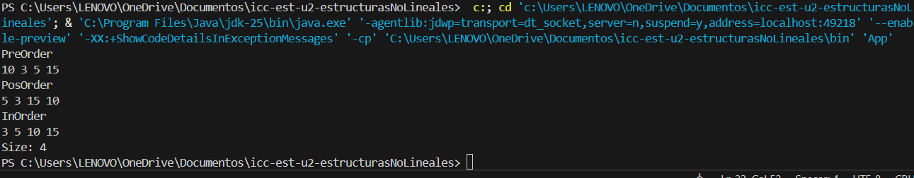
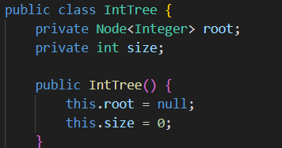
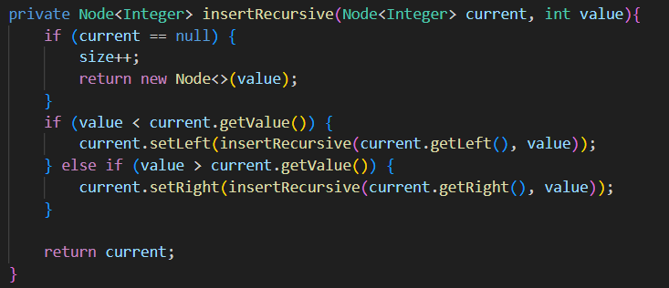
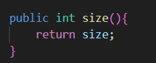
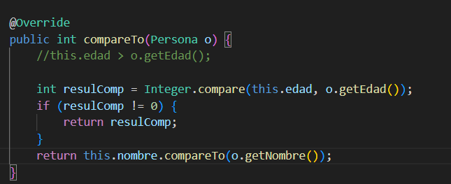
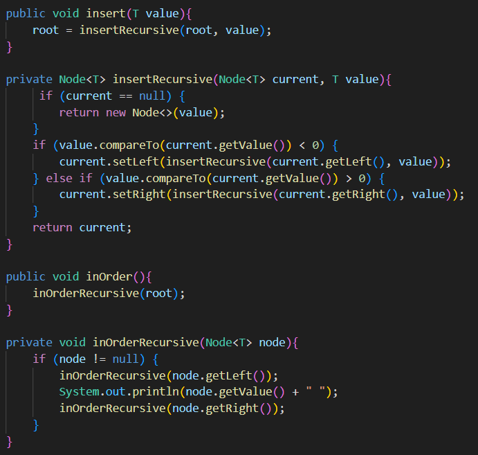
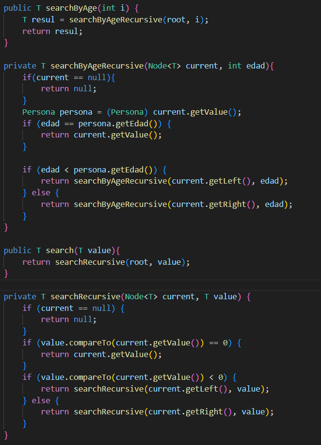
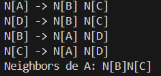
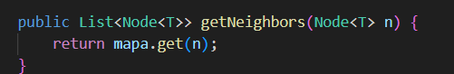

# Práctica: Estructuras No Lineales - 

## Autor
- Nombre: [Juan Miguel Naula A.]
- Carrera/Curso: [Computacion, Ciclo 2]

##  Nombre de la práctica - Fecha
- Práctica: [Arboles]
- Fecha: [2026-01-05]

## Descripción
Lo que alcanze a hacer son las carpetas models, nodes y trees que contienen sus respectivas clases, de la Clase Persona y Node lo que siempre se sabe poner, en la Clase IntTree hicimos sus metodos insert y tal y de paso agregamos lo que es PreOrder, PosOrder y InOrder y nos puso de tarea realizar Size en O(1)
## Evidencias
### Captura 1
Inserta aquí la captura del código o de la ejecución.
- Archivo: 

### Captura 2 
Inserta aquí una segunda captura si aplica.
- Archivo: 

##  Practica Arboles - Implementacion Genericos uso de interfaces Comparable - 06/01/26
- Práctica: [Arboles - Interface Comparable]
- Fecha: [2026-01-06]

## Descripción
Se completaron las clase de Persona y Tree, agregando en persona un ToString y un ComparableTo, en Tree lo que se hizo fue completar los metodos de insert y se agrego el InOrder y tambien se agregaron los metodos de busqueda
## Evidencias
### Captura 1
Inserta aquí la captura del código o de la ejecución.
- Archivo: 

### Captura 2 
Inserta aquí una segunda captura si aplica.
- Archivo: 

##  Practica Grafos - 08/01/26
- Práctica: [Grafos]
- Fecha: [2026-01-06]

## Descripción
Se agrego la clase Graph y se le añadio sus respectivos metodos
## Evidencias
### Captura 1
Inserta aquí la captura del código o de la ejecución.
- Archivo: 

### Captura 2 
Inserta aquí una segunda captura si aplica.
- Archivo: 

